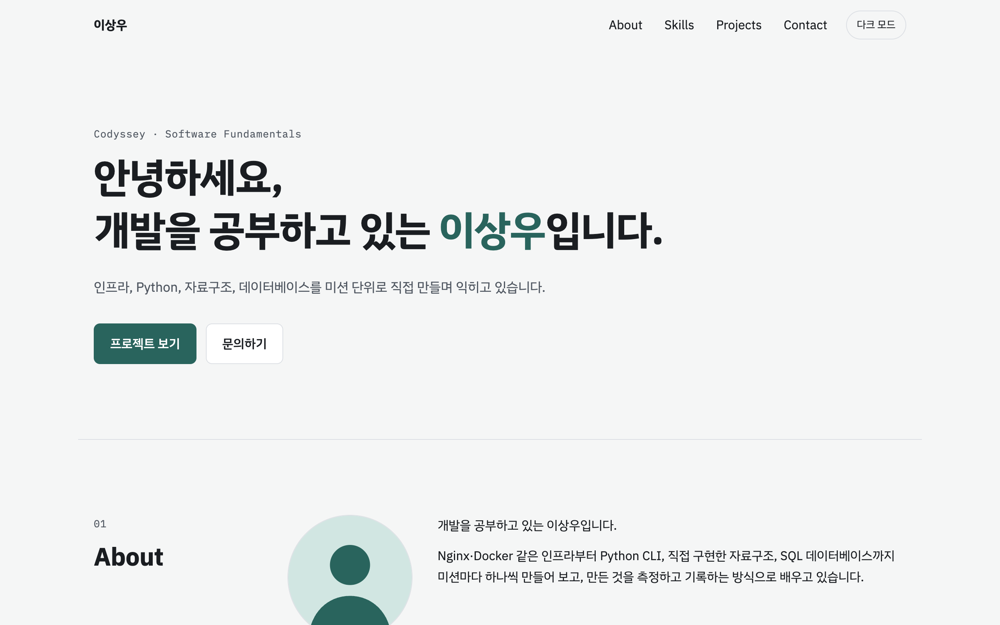
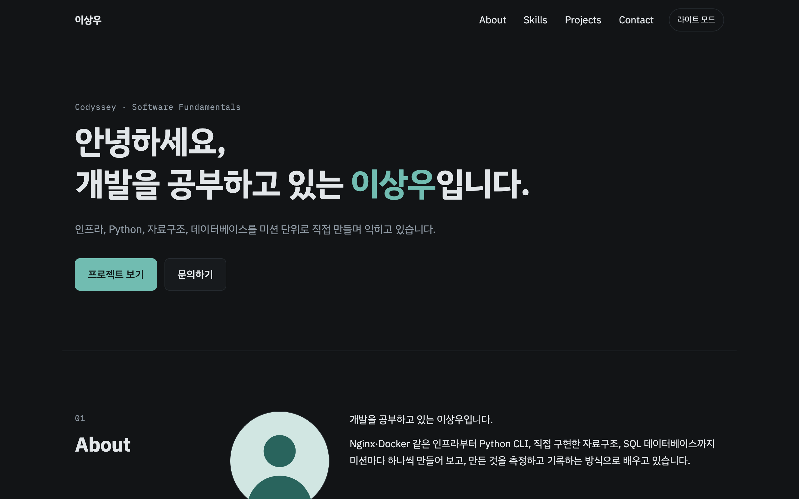
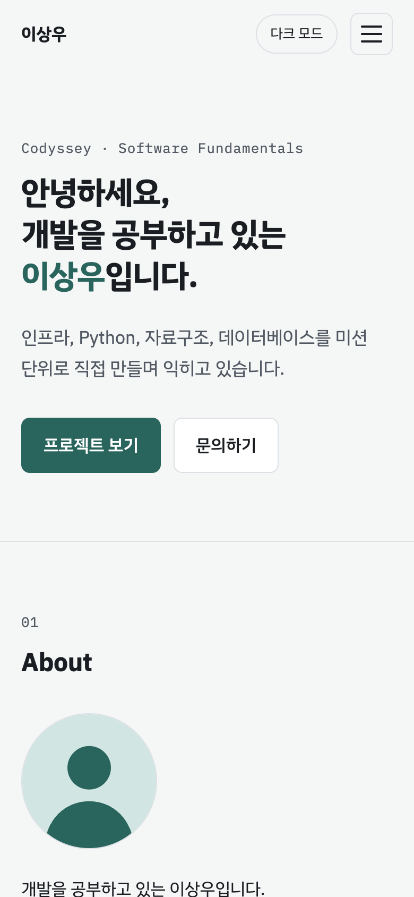

# 11 - 나를 소개하는 웹페이지 (Vanilla Portfolio)

외부 라이브러리 없이 순수 HTML / CSS / JavaScript 로 만든 반응형 포트폴리오.
목표는 화면의 완성도보다 **"사용자 이벤트 → 상태 변경 → 화면 업데이트"** 흐름을 코드에서 분명하게 드러내는 것이다.

- **배포 URL**: <https://sangwoo-codyssey.github.io/11-vanilla-portfolio/>
- 과제 원문: 로컬 `../11-vanilla-portfolio.md`

## 스크린샷

배포 URL 을 Chrome 으로 열어 찍었다 (데스크톱 1280×800 · 모바일 390×844, 2배 해상도).

**데스크톱**



**다크 모드**



**모바일**



## 사용 기술

| 영역 | 사용 |
|---|---|
| 마크업 | HTML5 시맨틱 태그 — `header` · `nav` · `main` · `section` · `article`(Projects 카드) · `footer` |
| 스타일 | `css/style.css` 하나. `:root` 변수(색·폰트·간격), `[data-theme="dark"]` 변수 재정의, 모바일 퍼스트 |
| 레이아웃 | 네비게이션 **Flexbox**(로고 왼쪽·메뉴 오른쪽), Projects 카드 **Grid**(`repeat(auto-fit, minmax(…))`) |
| 동작 | Vanilla JS (ES6+) — `querySelector(All)`, `addEventListener`, `classList`, `fetch` + `async/await` |
| 상태 유지 | `localStorage` (다크 모드) |
| 외부 API | GitHub REST API `GET /users/sangwoo-codyssey/repos` |
| 폰트 | Google Fonts — IBM Plex Sans KR · IBM Plex Mono (과제가 허용) |
| 배포 | GitHub Pages (`main` 브랜치 루트) |

사용하지 않은 것: React · Vue · jQuery · Bootstrap · Tailwind, 인라인 `style="…"`, HTML `onclick`, `var`.

**Flexbox 와 Grid 를 나눈 기준** — 아이템의 **내용이 크기를 정하면 Flexbox, 부모의 틀이 크기를 정하면 Grid** 를 쓴다.
네비(로고·메뉴·버튼을 한 줄로), Skills 칩(단어 길이만큼), 카드 내부(제목·설명·메타를 세로로)는 Flexbox 다.
Projects 카드 목록(행과 열을 맞춘 바둑판)과 데스크톱 섹션(왼쪽 제목 200px · 오른쪽 내용)은 Grid 다.
카드 목록을 `flex-wrap` 으로 바꿔 보면 카드 폭이 설명 길이에 따라 제각각이 되고 열이 맞지 않는다.

## 폴더 구조

```
.
├── index.html          # 메인 페이지 — Hero / About / Skills / Projects / Contact / Footer
├── css/
│   └── style.css       # 변수 · 레이아웃 · 반응형 · 다크 모드
├── js/                 # 전부 defer 로 연결, 적힌 순서대로 실행
│   ├── utils.js        # 공용 함수 (움직임 줄이기 감지, HTML escape)
│   ├── theme.js        # 다크 모드
│   ├── nav.js          # 햄버거 메뉴 · 부드러운 스크롤 · 스크롤 시 네비 배경
│   ├── scroll-top.js   # 스크롤 탑 버튼
│   ├── reveal.js       # 스크롤 애니메이션 (Intersection Observer)
│   ├── projects.js     # GitHub API → Projects 카드
│   └── contact.js      # 문의 폼 검증
├── images/             # 프로필 일러스트 · 파비콘 (SVG)
├── tests/              # 브라우저 점검 페이지 (아래 "확인 방법")
├── docs/screenshots/   # README 스크린샷
├── run.sh              # 로컬 서버 · 정적 검사
└── README.md
```

## 실행

```bash
./run.sh run      # 로컬 정적 서버 http://localhost:8000 (PORT 로 변경)
./run.sh test     # 과제 규칙 정적 검사
```

VS Code 에서는 Live Server 확장으로 `index.html` 을 열어도 된다(Open with Live Server). 빌드 단계가 없는 정적 사이트라 둘 다 같은 결과다.

## 설정값 (과제가 README 명시를 요구하는 항목)

| 항목 | 값 | 위치 |
|---|---|---|
| 스크롤 탑 버튼이 나타나는 기준 | **300px** | `js/scroll-top.js` `SCROLL_TOP_THRESHOLD` |
| 네비게이션 배경이 바뀌는 기준 | **60px** | `js/nav.js` `NAV_SCROLL_THRESHOLD` |
| Intersection Observer threshold | **0.2** (요소의 20% 가 보이면 나타남) | `js/reveal.js` `REVEAL_THRESHOLD` |
| 반응형 브레이크포인트 | **768px**(태블릿) · **1024px**(데스크톱) | `css/style.css` `@media (min-width: …)` |

브레이크포인트마다 바뀌는 것:

| 화면 폭 | 레이아웃 |
|---|---|
| 767px 까지 (기본) | 햄버거 버튼 + 드롭다운 메뉴 · About 은 이미지 위, 글 아래 · 섹션 제목 위, 내용 아래 |
| 768px 부터 | 햄버거가 사라지고 메뉴가 가로 한 줄 · About 은 이미지 왼쪽, 글 오른쪽 · 프로필 128px → 160px |
| 1024px 부터 | 섹션이 두 열(왼쪽 제목 200px · 오른쪽 내용) · Hero 위아래 여백이 커짐 |

Projects 카드의 열 수는 브레이크포인트와 따로, `auto-fit` 이 카드 폭 260px 이상이 유지되는 만큼 정한다.
700px 화면과 1280px 화면 모두 2열이다 — 1280px 에서는 섹션이 두 열이라 카드 영역이 약 792px 이기 때문이다.

## 이벤트 → 상태 → 렌더링

모든 기능 파일이 같은 모양을 따른다. 아래는 `js/nav.js` 를 줄여 옮긴 것이다.

```js
const navState = { menuOpen: false, scrolled: false };   // ① 이 기능의 상태는 여기에만 있다

function renderNav() {                                    // ② 상태를 보고 DOM 을 고치는 곳은 여기뿐
  navMenu.classList.toggle('active', navState.menuOpen);
  navToggle.setAttribute('aria-expanded', String(navState.menuOpen));
  siteHeader.classList.toggle('scrolled', navState.scrolled);
}

function setMenuOpen(menuOpen) {                          // ③ 상태를 바꾸는 유일한 길 → 바꾼 뒤 렌더링
  navState.menuOpen = menuOpen;
  renderNav();
}

navToggle.addEventListener('click', () => setMenuOpen(!navState.menuOpen));   // ④ 이벤트는 setXxx 만 부른다
```

DOM 을 직접 뒤집지 않고(`classList.toggle('active')` 만 호출하지 않고) **상태를 바꾼 뒤 그 상태로 다시 그린다.**
그래서 "지금 메뉴가 열려 있나?" 의 답은 언제나 `navState.menuOpen` 하나다.

| # | 이벤트 | 상태 | 화면 변화 | 파일 |
|---|---|---|---|---|
| 1 | 다크 모드 버튼 `click` | `themeState.theme` | `<html data-theme>` → CSS 변수 전체 교체, 버튼 문구, `localStorage` 저장 | `theme.js` |
| 2 | 햄버거 `click`, 메뉴 링크 `click`, `Esc` | `navState.menuOpen` | 메뉴 `.active`, 햄버거 `aria-expanded`(→ X 모양) | `nav.js` |
| 3 | `scroll` | `navState.scrolled` · `scrollTopState.visible` | 헤더 `.scrolled`(60px) · 스크롤 탑 `.visible`(300px) | `nav.js` · `scroll-top.js` |
| 4 | 페이지 진입, "다시 시도" `click` | `projectsState.status` = `loading` / `success` / `error` / `empty` | Projects 영역을 상태에 맞게 다시 그림 | `projects.js` |
| 5 | 입력 `input`, 칸 벗어남 `focusout`, `submit` | `contactState.values` · `touched` · `submitAttempted` · `submitted` | 필드 옆 에러 문구·빨간 테두리, 성공 문구 | `contact.js` |
| 6 | 요소가 화면에 20% 들어옴 | 요소별 `.reveal--pending` 유무 | 나타나는 애니메이션 | `reveal.js` |

## GitHub API 연동

- `fetch` + `async/await` + `try/catch`. `fetch` 는 404·403 에도 성공으로 끝나므로 `response.ok` 가 아니면 직접 `throw` 한다.
- 받은 데이터는 `filter`(fork 제외) → `map`(카드 HTML) 으로 바꾼다. 필드는 구조분해 할당으로 꺼내며 이름을 정리한다(`html_url: url`, `stargazers_count: stars`).

| 상태 | 화면 |
|---|---|
| 로딩 | 스피너 + "로딩 중..." |
| 성공 | 카드 목록 (Grid) + 저장소 수 |
| 에러 | "프로젝트를 불러올 수 없습니다." + 원인 + **다시 시도** 버튼 |
| 빈 목록 | "표시할 프로젝트가 없습니다." |

에러 상태의 원인 문구는 실패 종류마다 다르다. 실패는 두 길로 들어와 `catch` 하나에서 처리한다.

| 실패 | `catch` 로 가는 길 | 원인 문구 |
|---|---|---|
| 네트워크 실패 (오프라인·차단) | `fetch` 자체가 실패 → `await fetch(…)` 줄에서 바로 예외(`TypeError`) | 네트워크에 연결할 수 없습니다. 인터넷 연결을 확인해 주세요. |
| 403 + `X-RateLimit-Remaining: 0` | 응답은 도착 → `response.ok` 가 false → 직접 `throw` | GitHub API 요청 한도(시간당 60회)를 넘었습니다. {풀리는 시각} 이후에 다시 시도해 주세요. |
| 404 | 〃 | GitHub 에서 sangwoo-codyssey 사용자를 찾을 수 없습니다. |
| 그 밖의 HTTP 오류 | 〃 | GitHub 가 오류로 응답했습니다. (HTTP {상태 코드}) |

- **레이트 리밋**: 인증 없이 부르면 시간당 60회까지다. 403 과 `X-RateLimit-Remaining: 0` 이 오면 한도를 넘었다는 문구와 풀리는 시각을 보여준다.
- 저장소 이름·설명은 외부 데이터라 `escapeHtml` 을 거쳐 `innerHTML` 에 넣는다.
- "다시 시도" 버튼은 렌더링할 때마다 새로 만들어지므로, 버튼이 아니라 부모 요소에 리스너를 한 번 걸어 둔다(이벤트 위임).
- **상태 시연**: 주소 끝에 `?state=loading`, `?state=error`, `?state=empty` 를 붙이면 API 를 부르지 않고 그 상태를 그린다.
  예: <https://sangwoo-codyssey.github.io/11-vanilla-portfolio/?state=error#projects>

## 인터랙션

| 요구 | 구현 |
|---|---|
| 햄버거 메뉴 토글 | 768px 미만에서 햄버거가 보이고, 누를 때마다 메뉴가 열리고 닫힌다. 메뉴 링크를 누르거나 `Esc` 를 눌러도 닫힌다 |
| 부드러운 스크롤 | 섹션 링크 `click` → `event.preventDefault()` → `scrollIntoView({ behavior: 'smooth' })`. 고정 헤더에 제목이 가리지 않게 `scroll-margin-top` |
| 스크롤 탑 버튼 | 300px 부터 나타나고, 누르면 맨 위로 부드럽게 이동 |
| 네비게이션 스타일 변경 | 60px 부터 헤더에 배경·아래 선이 생긴다 |
| 다크 모드 | 버튼으로 전환, `localStorage` 에 저장해 새로고침 후에도 유지 |
| 스크롤 애니메이션 | threshold 0.2. 한 번 나타난 요소는 관찰을 끝낸다(`unobserve`) |
| 폼 UX | 필수값·이메일 형식 검증, 필드 바로 아래 에러 문구, `submit` 에서 `preventDefault` 후 성공 문구. 실제로 전송하지는 않는다 |

운영체제의 "동작 줄이기" 설정을 켠 사용자에게는 부드러운 스크롤과 애니메이션을 끈다(`prefers-reduced-motion`).

## 확인 방법

**정적 검사** — `./run.sh test`

| 분류 | 검사 |
|---|---|
| 코드 스타일 (과제 §7) | `var` 미사용 · HTML `onclick` 미사용 · 인라인 `style` 미사용 |
| HTML (과제 §4) | `img` 의 `alt` · `script` 의 `defer` · `label for` 와 `id` 짝 · 네비 앵커가 가리키는 섹션 · 시맨틱 태그 6종 · 필수 섹션 |
| 폴더 구조 (과제 §4) | `index.html` · `css/style.css` · `js/` · `images/` |

**브라우저 점검** — `./run.sh run` 후 Chrome 에서 아래 페이지를 연다. `index.html` 을 iframe 으로 띄워 클릭·스크롤·입력을 흉내 내고 결과를 PASS/FAIL 로 보여준다.
점검 페이지도 함께 배포되므로 배포본에서 바로 열 수도 있다 — 예: <https://sangwoo-codyssey.github.io/11-vanilla-portfolio/tests/interactions.html>

| 페이지 | 항목 | 내용 |
|---|---|---|
| `/tests/interactions.html` | 28 | 모바일/데스크톱 네비, 햄버거·`Esc`, 부드러운 스크롤, 60px·300px 경계, 스크롤 애니메이션, 다크 모드 저장·새로고침 유지 |
| `/tests/projects.html` | 19 | 실제 API 1회 호출 + 가짜 응답으로 로딩·빈 목록·fork 제외·403 한도 초과·404·네트워크 실패·다시 시도·escape·`?state=` |
| `/tests/contact.html` | 24 | `label`–`id` 연결, 빈 제출, 즉시 해제, 이메일 형식 경계, 공백만 입력, 성공 후 초기화, 건드리기 전에는 에러를 숨김 |

스크롤·전환 효과·Intersection Observer 는 화면 프레임이 있어야 동작해서, 헤드리스 브라우저의 가상 시간 모드에서는 점검이 실패한다. 실제 Chrome 에서 연다.

## 알려진 한계

- 모든 스크립트가 `defer` 라서, 다크 모드를 저장해 둔 상태로 새로고침하면 첫 화면에 아주 잠깐 밝은 테마가 보일 수 있다.
  없애려면 `<head>` 안, 스타일시트보다 앞에서 저장값을 읽어 `data-theme` 을 먼저 붙이는 작은 인라인 스크립트가 필요하다. 이 사이트는 스크립트를 전부 `js/` 파일로 나눠 `defer` 로 연결하는 구조라 넣지 않았다.
- 문의 폼은 검증까지만 한다. 실제 전송(Formspree 등)은 보너스라 하지 않았다.
- GitHub API 를 인증 없이 부르므로 같은 네트워크에서 시간당 60회를 넘기면 에러 상태가 된다(한도와 풀리는 시각을 보여준다).
- Projects 카드가 들어오기 전에 네비 링크를 누르면, 스크롤 목표는 누른 순간의 위치로 정해진다. 이동 중에 카드가 들어와 아래 섹션을 밀어내면 목표보다 위에서 멈춘다(느린 네트워크에서만 보인다).

## 제출물 체크리스트

- [x] GitHub 저장소 URL — <https://github.com/sangwoo-codyssey/11-vanilla-portfolio>
- [x] 배포된 사이트 URL (GitHub Pages) — <https://sangwoo-codyssey.github.io/11-vanilla-portfolio/>
- [x] 데스크톱 / 모바일 / 다크 모드 스크린샷 — `docs/screenshots/`
- [x] README (프로젝트 설명 · 사용 기술 · 배포 URL · 스크린샷)
